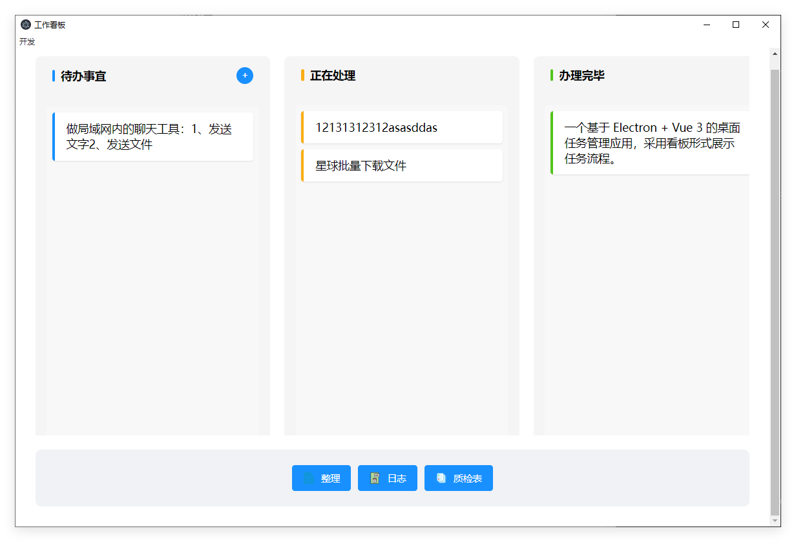
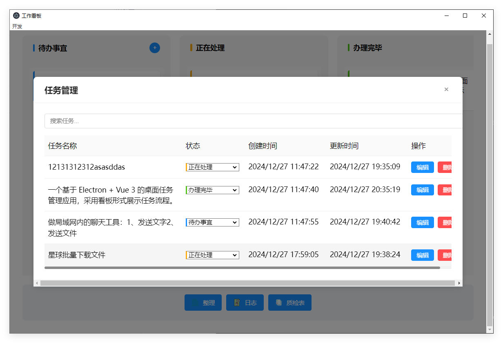

```markdown:README.md
# WorkBoard - 工作看板

A desktop task management application featuring Kanban-style workflow, built with Electron, Vue 3, and TypeScript.

一个基于 Electron + Vue 3 的桌面任务管理应用，采用看板形式展示任务流程。

## ✨ Features / 功能特性

- 📋 Kanban-style task management / 看板式任务管理（待办事宜、正在处理、办理完毕）
- 🔄 Drag-and-drop task organization / 任务拖拽排序
- ✏️ Real-time task editing / 实时任务编辑
- 🎯 Status tracking / 状态追踪
- 💾 Local data persistence / 本地数据存储
- 📱 Responsive design / 响应式设计

## 🛠️ Tech Stack / 技术栈

- Electron v28.1.1
- Vue 3.3.11
- TypeScript
- Pinia v2.1.7
- SQLite (better-sqlite3)
- Vite v5.0.8
- Vite-plugin-electron v0.3.0
- Electron-builder v25.0.5
- Node v18 测试了,必须18一下,高于18会报错,npm install会报错

## 📦 Installation / 安装

```bash
# Clone the repository
git clone https://github.com/your-username/workboard.git

# Navigate to the project directory
cd workboard

# Install dependencies
npm install

# Development
npm run dev

# Build
npm run build
```

## 🚀 Usage / 使用方法

### Development / 开发
#### npm run electron:dev

```bash
# Start the development server
npm run electron:dev
```

### Production / 生产环境

```bash
# Build for production
npm run electron:build
```

## 📝 Project Structure / 项目结构

```
workboard/
├── electron/          # Electron main process
├── src/
│   ├── assets/       # Static assets
│   ├── components/   # Vue components
│   ├── services/     # Services (database, etc.)
│   ├── stores/       # Pinia stores
│   ├── types/        # TypeScript types
│   └── main.ts       # Entry point
└── package.json
```

## 🖥️ Screenshots / 界面截图




## 🔧 Configuration / 配置

The application uses the following default configuration:

- Database: SQLite (stored in user data directory)
- Window size: 1200 x 800
- Development port: 5173 (Vite default)

## 📄 License / 许可

[MIT License](LICENSE)

## 🤝 Contributing / 贡献

Contributions, issues and feature requests are welcome!

欢迎贡献代码，提交问题和功能建议！

1. Fork the repository
2. Create your feature branch (`git checkout -b feature/AmazingFeature`)
3. Commit your changes (`git commit -m 'Add some AmazingFeature'`)
4. Push to the branch (`git push origin feature/AmazingFeature`)
5. Open a Pull Request

## 📮 Contact / 联系方式

[QQ：3394966158]
[微信：OFCOUZ]
[邮箱：3394966158@qq.com]

## 🙏 Acknowledgments / 致谢

- Vue.js Team
- Electron Team
- All contributors

---

<p align="center">Made with ❤️ by [OFCOUZ]</p>
```

